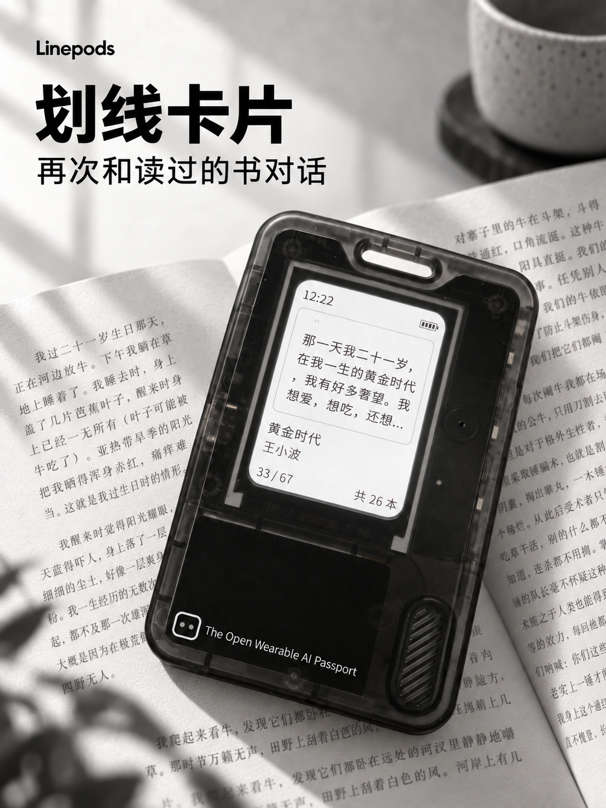
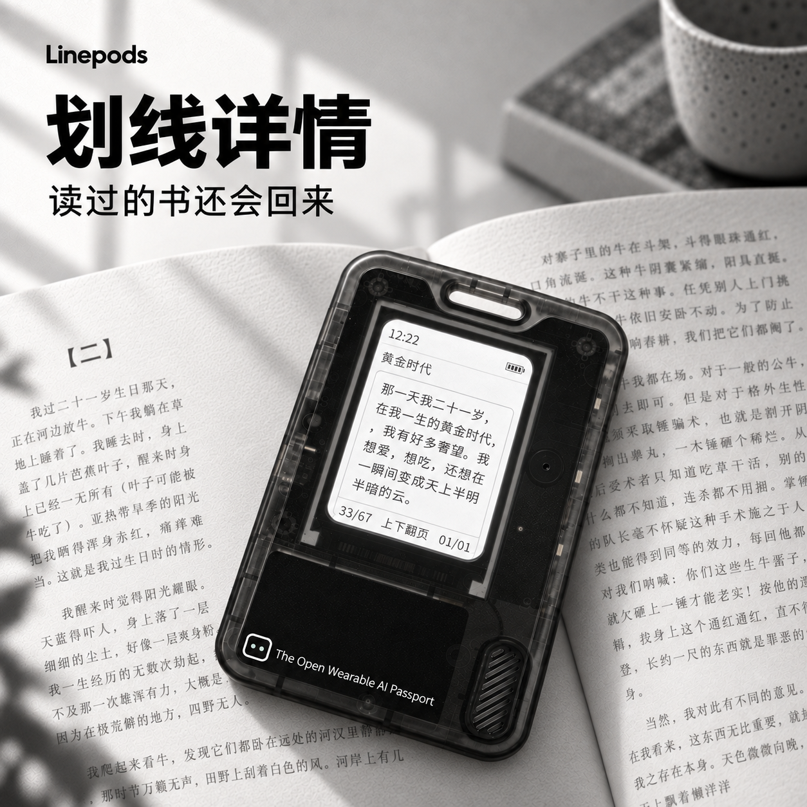

<p align="right">
  <a href="README.zh_CN.md">简体中文</a> · <strong>English</strong>
</p>

# Linepods

**Review your Weixin Read highlights anytime.**

Linepods turns the FoloToy AI Passport into a pocket highlight companion. Sync
your Weixin Read highlights once, then revisit them from the device without
opening your phone.

## Highlights

- A deliberate first-run flow: the device waits on a welcome page until setup
  is requested.
- Local setup from a phone over a temporary Linepods Wi-Fi hotspot.
- Highlight synchronization using your own Weixin Read API Key.
- Durable local caching for offline card browsing and paginated detail reading.
- Chinese typography designed and verified for the 240 x 320 display.
- Clear success and recovery screens, battery status, time, and low-power
  behavior.

## Screens

| Sync | Highlight card | Detail |
| --- | --- | --- |
|  |  |  |

## First use

1. Flash the verified merged firmware image from offset `0x0`.
2. On the welcome page, press the OK key to begin synchronization.
3. Connect your phone to the temporary `Linepods-XXXX` hotspot shown on the
   device, then open `192.168.4.1`.
4. Enter a 2.4 GHz Wi-Fi network and your Weixin Read API Key. In Weixin Read,
   the key is available under Me, Settings, Weixin Read Skills, Get API Key.
5. Submit the form and return to the device to see the validation and first-sync
   result.

Credentials are stored only after validation and a successful first sync. Do
not commit API keys or Wi-Fi passwords to this repository.

## Build

Linepods targets ESP32-C3 with 8 MB Flash, no PSRAM, and ESP-IDF 5.5.3.

```bash
source /path/to/esp-idf-v5.5.3/export.sh
./tools/validate.sh
```

The verified complete image is written to
`build/FoloToy-AI-Passport-full.bin`. Flash it from `0x0`; the merged image can
reset existing NVS settings.

## Release

Current release: **Linepods v0.1.0** (`v0.1.0-linepods`).

Linepods runs on the open-source FoloToy AI Passport hardware platform and is
released under the repository's [MIT License](LICENSE).
